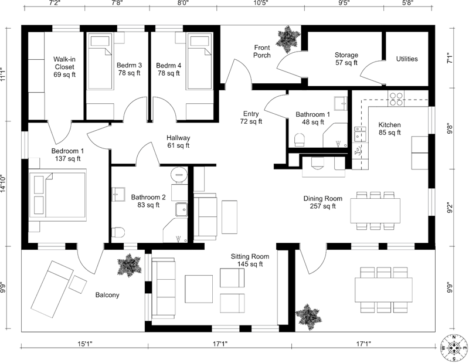

# 🏠 Image Mapper: Interactive Floor Plan

A modern, responsive web application for visualizing and exploring a house floor plan. Built with **Tailwind CSS** and **DaisyUI** for a beautiful, professional look and seamless user experience.

---

## ✨ Features

-   **Interactive Floor Plan:**
    -   Clickable image map lets users explore different rooms and areas.
    -   Each section links to a dedicated, visually rich page.
-   **Responsive Design:**
    -   Fully mobile-friendly and desktop-ready using Tailwind CSS utility classes.
-   **Modern UI:**
    -   Styled with DaisyUI for a clean, accessible, and attractive interface.
-   **Easy Navigation:**
    -   Instantly jump to any room or area from the main floor plan.
-   **Image-rich Pages:**
    -   Each room/area page can display relevant images and descriptions.

---

## 📁 Project Structure

```
image-maper/
│
├── index.html                # Main floor plan with interactive image map
├── images/
│   └── floor-plan.png        # Main floor plan image
├── pages/                    # Individual room/area pages
│   ├── balcony-1.html
│   ├── balcony-2.html
│   ├── bathroom-1.html
│   ├── ...
│   └── walk-in.html
└── README.md                 # Project documentation
```

---

## 🚀 Getting Started

1. **Clone or Download** this repository.
2. **Open `index.html`** in your browser. No build step required!
3. **Click** on any section of the floor plan to explore details about that area.

---

## 🖌️ Customization

-   **Add/Replace Images:**
    -   Place new images in the `images/` folder.
    -   Update the `src` attributes in HTML files as needed.
-   **Edit Room Details:**
    -   Modify the content of each HTML file in the `pages/` directory.
-   **Style:**
    -   Tailwind and DaisyUI are loaded via CDN for easy customization.

---

## 🛠️ Built With

-   [Tailwind CSS](https://tailwindcss.com/) (CDN)
-   [DaisyUI](https://daisyui.com/) (CDN)
-   HTML5

---

## 📸 Screenshot



---

## 🙏 Developed By

-   Developed by: _Jahidul Islam Jihad_

---

## 📄 License

This project is open source and free to use for educational or personal purposes.
